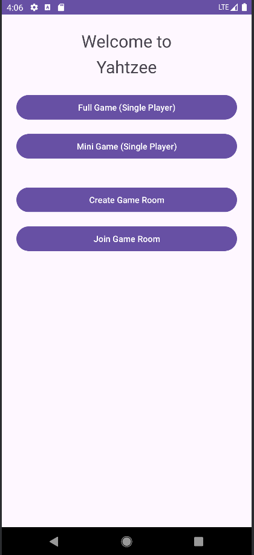

# Yahtzee Multiplayer Android Game

A mobile implementation of the classic Yahtzee dice game built in Android Studio.  
The application supports both single-player gameplay and real-time multiplayer matches using Firebase Realtime Database. Players can create or join game rooms using unique codes, take turns rolling dice, and compete with synchronized game state across devices.

This project focuses on mobile UI design, multiplayer game architecture, and real-time database synchronization.

---

## Overview

In this project, I built a fully functional **Yahtzee game for Android** and extended it from a **single-player experience into a multiplayer game**.

The application supports:

- Full Yahtzee gameplay (dice rolling, scoring logic, and scorecard)
- A **Mini Game** mode
- **Two-player multiplayer gameplay**
- Game rooms using a **join code system**
- Real-time synchronization using **Firebase Realtime Database**

---

## Key Features I Implemented

### Welcome Screen / Game Navigation

The app begins with a welcome screen that allows players to choose between different game modes.

Options include:

- **Full Game (Single Player)**
- **Mini Game (Single Player)**
- **Create Game Room**
- **Join Game Room**

---

### Single Player Gameplay

The original version of the project implemented a full **Yahtzee game experience**.

Features include:

- Dice rolling mechanics
- Scorecard categories
- Score calculation
- Turn-based gameplay
- User interaction through Android UI components

---

### Multiplayer Architecture

For the multiplayer version of the game, I implemented a **two-player game system**.

To simplify synchronization and turn management, the game is limited to **two players per session**.

Multiplayer functionality includes:

- Game room creation
- Game room joining
- Turn-based gameplay between two players
- Shared score tracking
- Real-time synchronization using Firebase

---

### Firebase Realtime Database Integration

The multiplayer functionality is powered by **Firebase Realtime Database**.

Firebase is used to store and synchronize:

- Player information
- Game room status
- Current turn
- Dice results
- Player scores
- Game state

When one player performs an action, the update is written to Firebase and instantly reflected on the other player's device.

---

## Technologies Used

- Android Studio
- Java / Kotlin
- Firebase Realtime Database
- Mobile UI Design
- Multiplayer Game Architecture
- Real-time state synchronization

---

## Screenshots

### Main Menu

---

## Notes

This repository summarizes my personal implementation and design decisions.

Full source code is not redistributed in order to comply with course academic policies.
